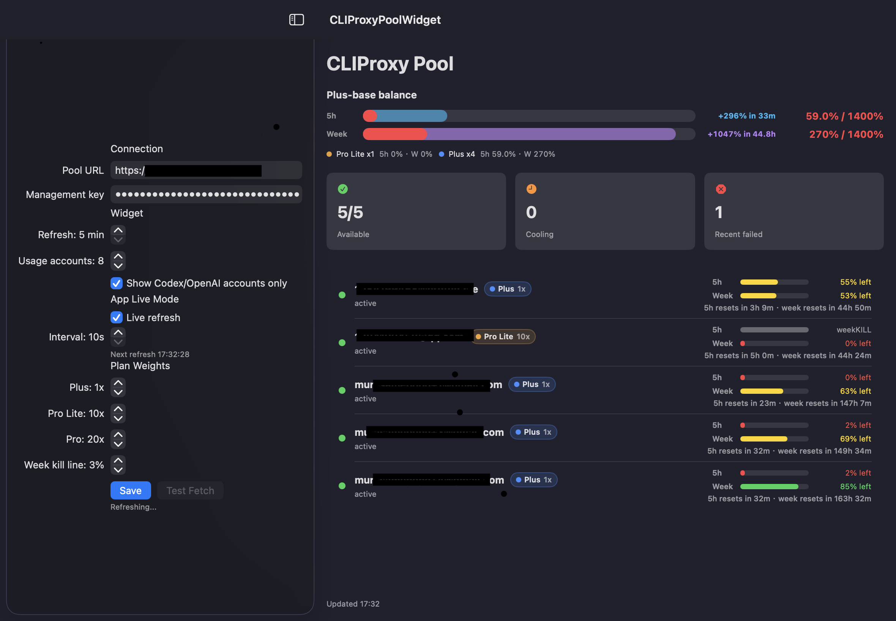
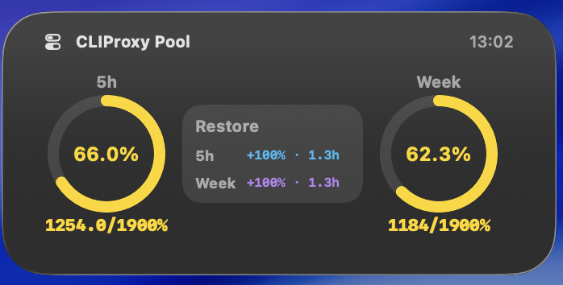

# CLIProxy Pool Widget

English | [中文](#中文说明)

A native macOS app and WidgetKit companion for monitoring CLIProxyAPI ChatGPT/Codex account quotas.

It shows pool health, per-account 5-hour usage, weekly usage, plan weights, and Plus-base remaining capacity directly in the app and in macOS desktop widgets.

> Community project. Not an official CLIProxyAPI component.

## Features

- Native SwiftUI macOS app
- WidgetKit widgets for small, medium, and large sizes
- Live refresh in the app
- Widget refresh interval starting at 5 minutes, subject to macOS WidgetKit scheduling
- CLIProxyAPI Management API integration
- ChatGPT `wham/usage` quota display through `/v0/management/api-call`
- 5-hour and weekly quota bars
- Graphical restore forecast segment on each quota bar
- Plus / Pro Lite / Pro plan badges
- Configurable Plus-base weights
- Weekly kill-line handling to avoid over-counting accounts with exhausted weekly quota
- Local-only settings storage

## Screenshots

Add screenshots here before publishing:

```markdown



```

Recommended screenshots:

- Main app overview with account rows visible
- Settings sidebar with sensitive values blurred
- Small widget on desktop
- Medium widget on desktop
- Large widget on desktop
- Optional: macOS widget picker showing "CLIProxy Pool"

Blur or crop:

- Management key
- Private pool URL if it is not meant to be public
- Account emails, account IDs, or auth indexes if sensitive

## How It Works

The app uses the same CLIProxyAPI Management API flow as the web control panel.

First it reads auth files:

```http
GET /v0/management/auth-files
Authorization: Bearer <management-key>
```

Then, for selected Codex/OpenAI-like accounts, it calls ChatGPT usage through CLIProxyAPI:

```http
POST /v0/management/api-call
Authorization: Bearer <management-key>
Content-Type: application/json

{
  "authIndex": "<auth_index>",
  "method": "GET",
  "url": "https://chatgpt.com/backend-api/wham/usage",
  "header": {
    "Authorization": "Bearer $TOKEN$",
    "Accept": "application/json",
    "Content-Type": "application/json"
  }
}
```

CLIProxyAPI replaces `$TOKEN$` with the selected account token.

## Install From Release

1. Download `CLIProxyPoolWidget.app.zip` from Releases.
2. Unzip it.
3. Move `CLIProxyPoolWidget.app` to `/Applications` or `~/Applications`.
4. Open the app once and configure:
   - Pool URL
   - Management key
   - Refresh options
   - Plan weights
5. Click `Save` to sync settings to the widget.
6. Add the `CLIProxy Pool` widget from macOS desktop widgets or Notification Center.

The main app can refresh live. The desktop widget is controlled by WidgetKit, so the configured refresh interval is a request to macOS rather than a hard timer.

Unsigned community builds may require extra macOS confirmation on first launch:

```bash
xattr -dr com.apple.quarantine /Applications/CLIProxyPoolWidget.app
```

Only run this for builds you trust.

## Build From Source

Requirements:

- macOS 14 or newer
- Xcode 16 or newer

Open `CLIProxyPoolWidget.xcodeproj` in Xcode, then configure both targets:

- `CLIProxyPoolWidget`
- `CLIProxyPoolWidgetExtension`

For a proper signed build:

1. Set your Apple Development Team.
2. Change the bundle identifiers if needed.
3. Change the App Group in both entitlements files.
4. Keep `PoolWatchConstants.appGroupID` in `Shared/PoolModels.swift` in sync.
5. Build and run.

For local unsigned development, you can build from Terminal:

```bash
xcodebuild \
  -scheme CLIProxyPoolWidget \
  -configuration Release \
  -destination 'platform=macOS,arch=arm64' \
  CODE_SIGNING_ALLOWED=NO \
  build
```

Then ad-hoc sign the app and widget extension with the included entitlements:

```bash
APP="$HOME/Library/Developer/Xcode/DerivedData/CLIProxyPoolWidget-*/Build/Products/Release/CLIProxyPoolWidget.app"

codesign --force --sign - \
  --entitlements Widget/CLIProxyPoolWidgetExtension.entitlements \
  "$APP/Contents/PlugIns/CLIProxyPoolWidgetExtension.appex"

codesign --force --sign - \
  --entitlements App/CLIProxyPoolWidget.entitlements \
  "$APP"
```

WidgetKit discovery can be stricter for unsigned builds. If the widget does not appear, open the app once, re-register LaunchServices, and log out/in if macOS keeps stale widget cache.

## Release Checklist

Before creating a GitHub Release:

- Build a clean Release app
- Open the clean build once and confirm `Test Fetch` works
- Confirm the widget appears in macOS widget picker
- Use screenshots with blurred Pool URL, Management key, emails, account IDs, and auth indexes
- Do not upload DerivedData
- Do not upload `~/Library/Preferences`
- Do not upload `~/Library/Group Containers`
- Do not upload screenshots containing keys or private account data
- Zip only the app bundle:

```bash
ditto -c -k --keepParent CLIProxyPoolWidget.app CLIProxyPoolWidget.app.zip
```

The app bundle does not include your local Management key by default. The key is stored at runtime in macOS user defaults on the user's machine. A release zip should contain only `CLIProxyPoolWidget.app`.

Recommended release assets:

- `CLIProxyPoolWidget.app.zip`
- A short changelog
- Screenshots under `docs/screenshots/` if you want them visible in the README

Do not upload a preconfigured app, app container, preferences file, App Group container, logs, or any exported request payload containing a Management key.

## Settings And Privacy

Settings are stored locally on the user's Mac.

- The main app stores its settings in normal app `UserDefaults`.
- The widget reads a copy from the App Group container after the user clicks `Save`.
- The Management key is not sent anywhere except to the configured CLIProxyAPI Management endpoint.
- This project does not use third-party analytics or telemetry.

The Management key is currently stored in user defaults for local convenience. For stronger security, a future version should move the key to Keychain sharing.

## Quota Model

The app shows two quota windows:

- `5h`: primary short window
- `Week`: weekly or secondary window

Each quota bar has two visual layers:

- Solid segment: current remaining quota
- Translucent segment: next grouped restore amount, projected to the quota level after the next restore batch

Restore forecast grouping:

- Accounts whose reset times are close together are grouped into one forecast batch
- The default grouping window is 30 minutes, with a small tolerance for API timing drift
- The label shows the grouped restore amount and the latest reset time in that batch

Progress colors:

- Red: 0-20% remaining
- Yellow: 20-70% remaining
- Green: 70-100% remaining

Default Plus-base weights:

- Plus: `1x`
- Pro Lite: `10x`
- Pro: `20x`

If an account's weekly quota falls below the configured kill line, it does not contribute to total remaining capacity. The account row still shows the raw 5-hour bar in a muted state with `weekKILL`.

The pool-level `5h` balance uses the raw 5-hour remaining quota for accounts that are not week-killed. Weekly quota is used as a kill switch, not as a cap on ordinary 5-hour restore calculation.

## Roadmap

- Keychain storage for the Management key
- Signed and notarized release workflow
- Multiple pool profiles
- Custom account labels
- Better diagnostics for WidgetKit registration
- Additional quota schema compatibility

## License

MIT License. See [LICENSE](LICENSE).

---

# 中文说明

[English](#cliproxy-pool-widget) | 中文

CLIProxy Pool Widget 是一个原生 macOS 桌面应用和 WidgetKit 小组件，用来监控 CLIProxyAPI 里的 ChatGPT/Codex 账号额度。

它可以在主应用和 macOS 桌面小组件里显示池子健康状态、单账号 5 小时额度、周额度、套餐权重，以及按 Plus 为基准计算的剩余额度。

> 社区项目，不是 CLIProxyAPI 官方组件。

## 功能

- 原生 SwiftUI macOS 应用
- 支持 small、medium、large 三种 WidgetKit 小组件尺寸
- 主应用支持实时刷新
- 小组件刷新间隔最低 5 分钟，但实际刷新由 macOS WidgetKit 调度决定
- 接入 CLIProxyAPI Management API
- 通过 `/v0/management/api-call` 获取 ChatGPT `wham/usage` 额度
- 同时显示 5 小时额度和周额度
- 每条额度进度条显示图形化恢复预测段
- Plus / Pro Lite / Pro 套餐标记
- 可配置 Plus 基准权重
- 支持周额度 kill line，避免周额度耗尽的账号造成总额度虚高
- 设置只保存在本机

## 截图

发布前建议把截图放到这里：

```markdown


```

推荐截图：

- 主应用概览，显示总额度和账号列表
- 设置侧边栏，敏感信息需要打码
- 桌面上的 small widget
- 桌面上的 medium widget
- 桌面上的 large widget
- 可选：macOS 小组件选择器里出现 `CLIProxy Pool`

需要打码或裁掉：

- Management key
- 不想公开的私有 Pool URL
- 账号邮箱、账号 ID、auth index 等敏感信息

## 工作原理

应用使用和 CLIProxyAPI Web 管理面板类似的 Management API 流程。

首先读取 auth files：

```http
GET /v0/management/auth-files
Authorization: Bearer <management-key>
```

然后对选中的 Codex/OpenAI 类账号，通过 CLIProxyAPI 请求 ChatGPT usage：

```http
POST /v0/management/api-call
Authorization: Bearer <management-key>
Content-Type: application/json

{
  "authIndex": "<auth_index>",
  "method": "GET",
  "url": "https://chatgpt.com/backend-api/wham/usage",
  "header": {
    "Authorization": "Bearer $TOKEN$",
    "Accept": "application/json",
    "Content-Type": "application/json"
  }
}
```

CLIProxyAPI 会把 `$TOKEN$` 替换为对应账号的 token。

## 从 Release 安装

1. 从 Releases 下载 `CLIProxyPoolWidget.app.zip`。
2. 解压。
3. 把 `CLIProxyPoolWidget.app` 移动到 `/Applications` 或 `~/Applications`。
4. 打开应用并配置：
   - Pool URL
   - Management key
   - 刷新选项
   - 套餐权重
5. 点击 `Save`，把设置同步给小组件。
6. 在 macOS 桌面小组件或通知中心里添加 `CLIProxy Pool`。

主应用可以实时刷新。桌面小组件由 WidgetKit 调度，所以你配置的刷新间隔是给 macOS 的刷新请求，不是严格定时器。

未签名的社区构建第一次打开时，macOS 可能需要额外确认：

```bash
xattr -dr com.apple.quarantine /Applications/CLIProxyPoolWidget.app
```

只对你信任的构建执行这个命令。

## 从源码构建

要求：

- macOS 14 或更新版本
- Xcode 16 或更新版本

用 Xcode 打开 `CLIProxyPoolWidget.xcodeproj`，然后配置两个 target：

- `CLIProxyPoolWidget`
- `CLIProxyPoolWidgetExtension`

如果要做正常签名构建：

1. 设置你的 Apple Development Team。
2. 如有需要，修改 bundle identifier。
3. 修改两个 entitlements 文件里的 App Group。
4. 保持 `Shared/PoolModels.swift` 里的 `PoolWatchConstants.appGroupID` 与 App Group 一致。
5. 构建并运行。

本地无签名开发可以使用：

```bash
xcodebuild \
  -scheme CLIProxyPoolWidget \
  -configuration Release \
  -destination 'platform=macOS,arch=arm64' \
  CODE_SIGNING_ALLOWED=NO \
  build
```

然后用仓库里的 entitlements 对应用和小组件扩展做 ad-hoc 签名：

```bash
APP="$HOME/Library/Developer/Xcode/DerivedData/CLIProxyPoolWidget-*/Build/Products/Release/CLIProxyPoolWidget.app"

codesign --force --sign - \
  --entitlements Widget/CLIProxyPoolWidgetExtension.entitlements \
  "$APP/Contents/PlugIns/CLIProxyPoolWidgetExtension.appex"

codesign --force --sign - \
  --entitlements App/CLIProxyPoolWidget.entitlements \
  "$APP"
```

未签名构建下，WidgetKit 的发现机制会更严格。如果小组件没有出现，先打开一次应用，重新注册 LaunchServices；如果 macOS 仍保留旧缓存，可以尝试注销后重新登录。

## Release 检查清单

创建 GitHub Release 前：

- 构建干净的 Release app
- 打开干净构建，确认 `Test Fetch` 可用
- 确认 macOS 小组件选择器能看到小组件
- 截图里的 Pool URL、Management key、邮箱、账号 ID、auth index 都要打码
- 不要上传 DerivedData
- 不要上传 `~/Library/Preferences`
- 不要上传 `~/Library/Group Containers`
- 不要上传包含 key 或私有账号信息的截图
- 只压缩 app bundle：

```bash
ditto -c -k --keepParent CLIProxyPoolWidget.app CLIProxyPoolWidget.app.zip
```

默认情况下，app bundle 不会包含你的本地 Management key。key 是用户运行应用后保存在自己 Mac 的 user defaults 里。Release zip 应该只包含 `CLIProxyPoolWidget.app`。

推荐的 release assets：

- `CLIProxyPoolWidget.app.zip`
- 简短 changelog
- 如果希望 README 直接展示截图，把图片放到 `docs/screenshots/`

不要上传预配置好的 app、app container、preferences 文件、App Group 容器、日志，或者任何包含 Management key 的请求 payload。

## 设置与隐私

设置保存在用户本机。

- 主应用把设置保存在普通 app `UserDefaults`。
- 用户点击 `Save` 后，小组件从 App Group 容器读取一份同步副本。
- Management key 只会发送到用户配置的 CLIProxyAPI Management endpoint。
- 本项目没有第三方分析或遥测。

目前 Management key 为了本地使用方便，仍保存在 user defaults。更安全的后续版本应该改用 Keychain sharing。

## 额度模型

应用显示两个额度窗口：

- `5h`：短周期主窗口
- `Week`：周额度或 secondary window

每条额度条有两层图形：

- 实色段：当前剩余额度
- 半透明段：下一批恢复额度，表示恢复后会到达的位置

恢复预测聚合规则：

- reset 时间接近的账号会合并成同一批恢复预测
- 默认聚合窗口是 30 分钟，并带有少量容差来抵消 API 返回时间差
- 标签显示这一批会恢复多少，以及这一批里最晚的 reset 时间

进度条颜色：

- 红色：剩余 0-20%
- 黄色：剩余 20-70%
- 绿色：剩余 70-100%

默认 Plus 基准权重：

- Plus：`1x`
- Pro Lite：`10x`
- Pro：`20x`

如果某个账号的周额度低于配置的 kill line，它不会计入总剩余额度。账号行仍会以灰色显示原始 5 小时进度，并标记 `weekKILL`。

池子级别的 `5h` 余额会使用未被 week kill 的账号的原始 5 小时剩余额度。周额度只作为 kill switch，不会在普通情况下截断 5 小时恢复额度。

## Roadmap

- 用 Keychain 保存 Management key
- 签名和 notarized 发布流程
- 多个 pool 配置
- 自定义账号名称
- 更好的 WidgetKit 注册诊断
- 兼容更多未来 quota schema

## License

MIT License. See [LICENSE](LICENSE).
